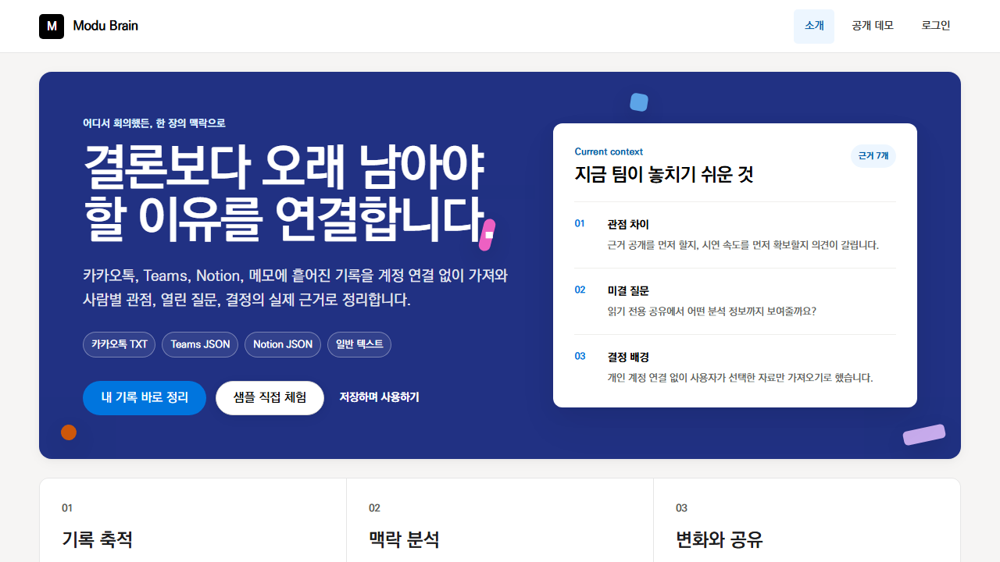
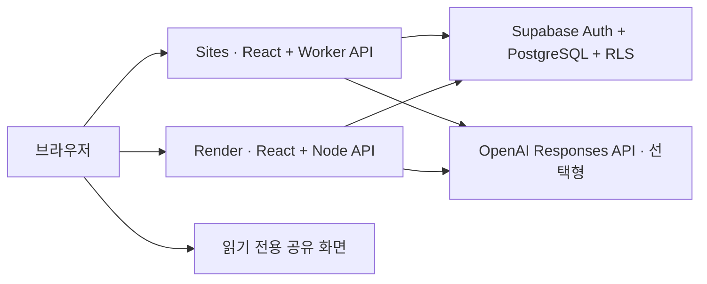

# Modu Brain

Modu Brain은 회의록, 리서치, 피드백에 흩어진 결정 배경과 참여자 관점, 미결 질문을 원문 근거와 함께 구조화하는 협업 맥락 웹 앱입니다. 로그인 사용자는 프로젝트와 기록을 저장하고 분석 이력을 비교할 수 있으며, 특정 분석 결과만 만료 가능한 읽기 전용 링크로 공유할 수 있습니다. 카카오톡 TXT, Teams·Notion JSON, 직접 붙여넣기도 개인 계정 연결 없이 공통 기록으로 가져와 원문 백링크와 Obsidian형 브레인 캔버스에서 함께 확인할 수 있습니다.

[공개 웹 데모](https://modu-brain-n031.ksjun29.chatgpt.site) · [내 저장소에서 새 Render 서비스 만들기](https://render.com/deploy?repo=https://github.com/tjwnsdhfz/modu-brain) · [독립 배포 가이드](docs/standalone-deployment.md)

이 저장소는 `tjwnsdhfz/modu-brain`이 직접 소유하는 독립 저장소입니다. 기본 branch는 `main`이며, 조직 저장소의 maintainer 승인이나 포크 워크플로에 의존하지 않습니다. OpenAI 기능은 기본적으로 꺼져 있고 비용이 없는 `local-heuristic` 분석을 사용합니다.



## 공개 데모 구조



- `/`: 로그인 없이 붙여넣기·카카오톡 TXT·Teams JSON·Notion JSON을 정규화하고 분석하는 비영속 워크스페이스
- `/demo`: 사전 구성된 한국어 기록과 분석 결과를 바로 여는 공개 데모
- `/login`: Supabase 이메일 Magic Link 로그인
- `/projects`: 사용자 소유 프로젝트 목록과 생성
- `/projects/:id`: 외부 맥락 가져오기, 기록, 분석 이력, 검색·필터·근거 탐색이 가능한 브레인 캔버스, 백링크, 온보딩, 공유
- `/share#token=…`: 원문을 제외한 읽기 전용 분석 결과
- `/api/v1/**`: HttpOnly 세션, 사용자 범위 RLS 읽기와 service-only 소유권 검증 쓰기가 적용된 영속 API
- `/api/v1/public/context-analysis/import`: 계정 없이 내보낸 기록을 정규화한 뒤 로컬 분석하는 same-origin 비영속 API
- `/api/context-analysis*`: 제거된 구형 경로. `410 LEGACY_ENDPOINT_REMOVED`와 대체 경로를 반환

## 로컬 실행

### 준비물

- Node.js `22.20.0` (`.nvmrc`)
- Docker와 [Supabase CLI](https://supabase.com/docs/guides/local-development/cli/getting-started) — 영속 프로젝트 흐름과 DB 정책 테스트에 필요

```bash
npm ci
cp .env.example .env
```

Windows PowerShell에서는 `Copy-Item .env.example .env`를 사용합니다. `.env`의 Supabase 값을 실제 로컬 또는 전용 개발 프로젝트 값으로 교체합니다.

로컬 Supabase를 사용하는 경우:

```bash
supabase start
supabase db reset
supabase test db
```

`supabase status -o env`의 `API_URL`, `ANON_KEY`, `SERVICE_ROLE_KEY`는 로컬 CLI용 legacy 변수에 매핑할 수 있습니다. 호스팅 프로젝트에서는 새 `publishable`/`secret` 키를 우선 사용합니다. `npm run build`는 Sites용 Worker와 SPA를 `dist/server`, `dist/client`에 만들며, Node 서버는 같은 SPA와 API를 Render 및 로컬에서 제공합니다.

```bash
npm run build
npm run start
```

브라우저에서 `http://127.0.0.1:4173`을 엽니다. UI만 빠르게 수정할 때는 `npm run dev`를 사용할 수 있지만, 인증·DB API를 포함한 최종 검증은 위 full-stack 명령을 기준으로 합니다.

## 환경변수

| 이름 | 노출 | 용도 |
| --- | --- | --- |
| `SUPABASE_URL` | 서버 | Supabase 프로젝트 API URL |
| `SUPABASE_PUBLISHABLE_KEY` | 서버 | 사용자 JWT와 함께 보내는 공개 PostgREST API key |
| `SUPABASE_SECRET_KEY` | 서버 전용 | 소유권 재검증 `app_*` 쓰기 RPC, admin Auth, 공유 조회와 유지보수. 브라우저에 절대 노출하지 않음 |
| `VITE_SUPABASE_URL` | 공개 번들 | 브라우저 Magic Link Auth URL |
| `VITE_SUPABASE_PUBLISHABLE_KEY` | 공개 번들 | RLS로 보호되는 공개 publishable key |
| `SUPABASE_ANON_KEY`, `SUPABASE_SERVICE_ROLE_KEY`, `VITE_SUPABASE_ANON_KEY` | 호환 | 로컬 Supabase CLI의 legacy JWT key fallback |
| `MODU_BRAIN_ANALYSIS_PROVIDER` | 서버 | 기본 `local-heuristic`; 영속 분석과 공개 가져오기 분석의 provider 선택 |
| `MODU_BRAIN_OPENAI_ENABLED` | 서버 | `true`일 때만 인증된 V1 API에서 OpenAI 선택 허용. 기본 `false` |
| `MODU_BRAIN_OPENAI_MODEL` | 서버 | 기본 `gpt-5.6-terra`; 계정의 preview 접근 권한 확인 필요 |
| `MODU_BRAIN_OPENAI_REASONING_EFFORT` | 서버 | 기본 `low` |
| `OPENAI_API_KEY` | 서버 전용 | 로그인 사용자가 명시적으로 OpenAI 분석을 선택할 때만 필요 |
| `SAFETY_IDENTIFIER_SECRET` | 서버 전용 | 사용자 UUID를 비식별 `safety_identifier`로 해시할 때 사용하는 salt |
| `IP_HASH_SECRET` | 서버 전용 | rate limit용 IP를 복원하기 어려운 HMAC으로 변환하는 별도 비밀키 |
| `HOST` | 서버 | 로컬 기본 `127.0.0.1`, Render는 `0.0.0.0` |
| `PORT` | 서버 | 로컬 기본 `4173`, Render가 배포 시 제공 |

`SUPABASE_SECRET_KEY`/legacy service role과 `OPENAI_API_KEY`는 저장소, `render.yaml`의 평문 값, Vite 변수, 브라우저 로그에 넣지 않습니다. `gpt-5.6-terra`를 사용할 수 없는 계정은 `MODU_BRAIN_OPENAI_MODEL`을 접근 가능한 구조화 출력 모델 ID로 명시적으로 바꿉니다. 자동 모델 fallback은 하지 않습니다.

## 데이터베이스와 인증

SQL migration은 `supabase/migrations/`가 유일한 스키마 원본입니다. Dashboard에서만 스키마를 수정하거나 앱 시작 시 migration을 자동 실행하지 않습니다.
대응하는 `supabase/rollback/` down SQL은 CI에서 적용 후 실행하고 같은 migration을 재적용해 가역성을 확인합니다.

- `projects`: 개인 소유 프로젝트
- `source_records`: 회의·리서치·피드백·메모 원문
- `analysis_runs`: 실행 상태, provider, 버전별 JSON 결과와 안전한 오류
- `analysis_run_sources`: 분석 당시 원문의 불변 스냅숏
- `analysis_run_step_events`: 원문·prompt·사고과정 없이 4단계 상태와 검증·소요 지표만 보관하는 append-only 이벤트
- `analysis_run_annotations`: 성공 결과에 사용자가 남기는 idempotent·불변 검토 기록
- `share_links`: SHA-256으로 해시된 만료·폐기 가능 토큰
- `rate_limit_buckets`: 사용자·IP별 AI/공유 조회 제한

모든 앱 테이블은 RLS를 사용합니다. Magic Link token은 same-origin BFF가 즉시 HttpOnly·SameSite 쿠키로 교환하며 Web Storage에 보관하지 않습니다. 브라우저의 `/api/v1/**` 요청은 Bearer header를 만들지 않습니다. 읽기는 검증된 사용자 JWT와 RLS, 쓰기는 service-only `app_*` RPC의 사용자 ID·소유권 재검증을 함께 사용합니다. 다른 사용자 리소스는 존재 여부가 노출되지 않도록 `404`로 응답합니다. 공개 공유 API만 토큰 해시와 만료·폐기 상태를 서버에서 검증한 뒤 원문을 제외한 결과를 반환합니다.

## 분석 계약

영속 분석은 선택한 기록 ID와 `Idempotency-Key`를 받습니다. 소유권·입력 길이·요청 키를 먼저 검증한 뒤 다음 4단계를 append-only 이벤트로 추적합니다.

1. `source_snapshot`: `running` 실행과 선택 원문의 불변 스냅숏을 저장합니다.
2. `provider_analysis`: DB 트랜잭션 밖에서 로컬 또는 OpenAI provider를 호출합니다.
3. `evidence_validation`: 결과 스키마와 모든 인용문이 스냅숏의 실제 부분 문자열인지 검증합니다.
4. `result_persistence`: 실행을 `succeeded`, `failed`, `cancelled` 중 하나로 확정합니다.

같은 프로젝트·같은 키·같은 입력은 기존 실행을 반환합니다. 같은 키에 다른 입력은 `409`이며, 실패한 실행은 최근 성공 결과를 덮어쓰지 않습니다. OpenAI 요청은 서버에서만 실행하고 `store: false`, 비식별 `safety_identifier`, 30초 제한을 적용합니다.

프로젝트 이름과 모든 원문은 provider 관점에서 신뢰하지 않는 데이터입니다. 원문 안의 역할 변경·비밀 공개·출력 변경 지시는 따르지 않으며 hidden reasoning 또는 chain-of-thought를 요청·저장·반환하지 않습니다. 원문은 사용자가 선택한 `source_records`와 실행 스냅숏에만 보관하고 단계 이벤트·annotation·로그에는 복제하지 않습니다. 성공 실행에는 수정 불가능한 annotation을 추가할 수 있지만 annotation은 후속 분석 입력이나 공유 결과에 자동 포함되지 않습니다.

## API 요약

```text
GET|POST       /api/v1/projects
GET|PATCH|DELETE /api/v1/projects/:projectId
GET|POST       /api/v1/projects/:projectId/sources
POST           /api/v1/projects/:projectId/imports
PATCH|DELETE   /api/v1/sources/:sourceId
GET            /api/v1/sources/:sourceId/segments
GET|POST       /api/v1/projects/:projectId/analysis-runs
GET|DELETE     /api/v1/analysis-runs/:runId
GET            /api/v1/analysis-runs/:runId/step-events
GET|POST       /api/v1/analysis-runs/:runId/annotations
GET|POST       /api/v1/analysis-runs/:runId/share-links
DELETE         /api/v1/share-links/:shareLinkId
POST           /api/v1/shared/resolve
POST           /api/v1/public/context-analysis/import
GET            /api/v1/capabilities
GET            /api/health/live
GET            /api/health/ready
```

성공 응답은 `{ "data": … }`, 실패 응답은 `{ "error": { "code", "message", "details" } }` 형식입니다. 자세한 계약은 [TRD](docs/trd.md)와 [에이전트 워크플로 계약](docs/agent-workflow-contract.md)을 참고합니다.

## 품질 확인

```bash
npm run lint
npm run typecheck
npm run test:coverage
npm run ops:validate
npm run build
npm run test:e2e:install
npm run test:e2e
```

- Vitest: 서버·클라이언트 계약, 보안 경계, 로컬 분석 회귀
- SQL/pgTAP: 빈 DB 적용·down rollback·재적용과 92개 RLS/권한 계약
- 한국어 eval 30건: 회의·리서치·피드백·빈 근거·개인정보·prompt injection 문구를 유료 호출 없이 검증
- Playwright: 공개 가져오기·모바일 메뉴·리플로우와 `로그인 → 프로젝트 → 외부 맥락 가져오기 → 분석 → 근거·백링크 → 이력 → 공유 → 새로고침`
- GitHub Actions: lint, typecheck, coverage, build, production audit, secret scan, 공개 스모크, 내부 PR의 로컬 Supabase/E2E
- GitHub Actions uptime: 6시간마다 공개 live endpoint를 확인하며, `MODU_BRAIN_MONITOR_TARGETS` 저장소 변수로 대상을 완전히 교체할 수 있습니다.

## Sites 배포

이 저장소는 `.openai/hosting.json`의 기존 Sites 프로젝트 ID를 재사용합니다. Supabase가 인증·PostgreSQL·RLS 영속 계층이므로 Sites의 D1/R2는 사용하지 않습니다.

1. `VITE_SUPABASE_URL`, `VITE_SUPABASE_PUBLISHABLE_KEY`로 `npm run build`를 실행합니다.
2. `dist/server/index.js`, `dist/client/index.html`, `dist/.openai/hosting.json`이 생성됐는지 확인합니다.
3. Sites 런타임에는 `SUPABASE_URL`, `SUPABASE_PUBLISHABLE_KEY`, `SUPABASE_SECRET_KEY`, 분석 provider 변수와 `SAFETY_IDENTIFIER_SECRET`을 설정합니다.
4. 정확히 커밋·푸시한 소스와 그 커밋에서 만든 archive로 버전을 저장하고 배포합니다.
5. 배포 origin의 `/login`을 Supabase Auth redirect allowlist에 추가한 뒤 readiness와 Magic Link 흐름을 확인합니다.

`npm run preview`는 Sites와 동일한 workerd 경로를 로컬에서 실행합니다. 비밀키는 Worker 런타임 환경에만 두고 `VITE_*` 변수로 전달하지 않습니다.

## Render 배포

`render.yaml`은 단일 Node Web Service를 정의합니다. Render에서 Blueprint를 연결하기 전에 다음을 완료합니다.

[](https://render.com/deploy?repo=https://github.com/tjwnsdhfz/modu-brain)

1. 별도 Supabase 데모 프로젝트를 만들고 migration을 적용합니다.
2. Auth Site URL을 Render origin으로 두고 `https://<service>.onrender.com/login`을 redirect allowlist에 허용합니다. 로컬 검증에는 `http://127.0.0.1:4173/login`도 추가합니다.
3. `render.yaml`에서 `sync: false`인 Supabase 값을 Dashboard에 입력합니다. OpenAI를 켤 때만 별도로 API key를 추가합니다.
4. `VITE_SUPABASE_*`와 서버용 Supabase URL·anon key가 같은 프로젝트를 가리키는지 확인합니다.
5. `GET /api/health/ready`가 `200`인지 확인한 뒤 공개합니다.

Render는 `npm ci --include=dev && npm run build`, `npm start`, `HOST=0.0.0.0`을 사용하며 CI 성공 후 자동 배포합니다. build 단계에는 TypeScript/Vite 도구를 포함하고 runtime은 `NODE_ENV=production`을 유지합니다. readiness는 DB/config를 확인하므로 필수 환경변수가 없으면 의도적으로 `503`을 반환하고 배포 트래픽을 받지 않습니다. [Render Blueprint 문서](https://render.com/docs/blueprint-spec)

## 무료 uptime 확인

`.github/workflows/modu-brain-uptime.yml`은 6시간마다 `/api/health/live`만 호출합니다. GitHub 저장소의 **Settings → Secrets and variables → Actions → Variables**에 `MODU_BRAIN_MONITOR_TARGETS`를 쉼표로 구분한 HTTPS URL 목록으로 등록하면 기존 데모 주소를 사용하지 않고 새 Sites·Render 주소만 확인합니다. 수동 실행에서는 Actions의 **Modu Brain uptime → Run workflow**에서 같은 값을 일회성으로 덮어쓸 수 있습니다. 결과는 실행 요약과 14일 보존 artifact에 남고, 하나라도 실패하면 workflow가 실패합니다.

## 보안·개인정보 운영 기준

- 원문과 분석 스냅숏은 사용자가 명시적으로 저장하며 프로젝트 영구 삭제 시 함께 제거합니다.
- 공유 토큰은 URL query나 서버 로그가 아닌 `/share#token=…` fragment로 전달하고 DB에는 해시만 저장합니다.
- 공유 링크 기본 만료는 7일, 최대 30일이며 즉시 폐기할 수 있습니다.
- 공유 결과에는 원문 전체, 사용자 이메일, 내부 provider 오류를 포함하지 않습니다.
- AI 실행은 사용자당 동시 1건·시간당 10건·일당 30건, 공유 조회는 IP당 시간당 60건으로 제한합니다.
- JSON 본문은 256KB, 영속 분석 입력 합계는 100,000자 이하로 제한합니다. 공개 가져오기는 IP당 시간당 20회, 정규화 후 20,000자까지 허용합니다.
- 비밀정보·JWT·원문은 애플리케이션 로그에 기록하지 않습니다.
- 단계 이벤트에는 원문·prompt·provider 응답·hidden reasoning을 저장하지 않으며 annotation도 모델 입력으로 자동 사용하지 않습니다.
- 공개 전 Supabase RLS, Auth redirect allowlist, Sites·Render secrets, OpenAI 모델 권한을 다시 확인합니다.

## 현재 제외 범위

팀 초대·역할 관리, 공동 편집, Slack·Notion·Teams 계정/OAuth 직접 연결, 결제, 실시간 동기화, 백그라운드 작업 큐, 임의 두 분석 간 비교는 이번 공개 데모에서 제외합니다. 사용자가 선택한 카카오톡 TXT와 Teams·Notion JSON 가져오기는 계정 연결 없이 지원합니다.

## 문서와 디자인

- [PRD](docs/prd.md)
- [TRD](docs/trd.md)
- [에이전트 워크플로 계약](docs/agent-workflow-contract.md)
- [프롬프트 설계](docs/prompt-design.md)
- [Figma 개발 핸드오프](docs/figma-handoff.md)
- [KoPubWorld 돋움 웹 임베딩 안내](docs/kopub-font-embedding.md)
- [PR 벤치마크](docs/benchmark-prs.md)
- [PR 설명 초안](docs/pr-description-draft.md)
- [무료 운영·백업·장애 대응 런북](docs/operations/free-tier-runbook.md)
- [Supabase migration ledger 정합화 절차](docs/operations/migration-ledger-reconciliation.md)
