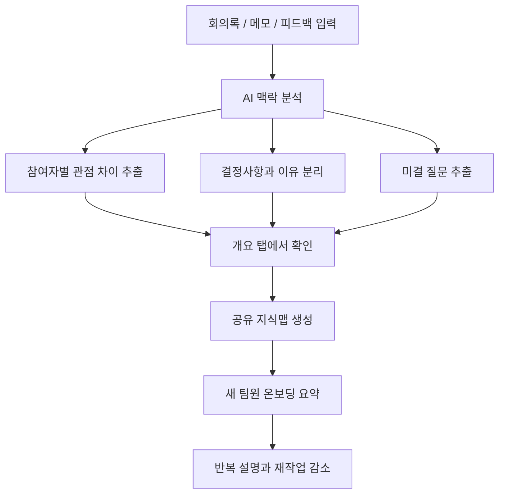

# 모두의 뇌 기획서

## 1. 프로젝트 주제

**모두의 뇌 - 협업 맥락 공유 AI 에이전트**

모두의 뇌는 팀 프로젝트, 공모전, 연구 프로젝트처럼 여러 사람이 하나의 목표를 함께 진행할 때 흩어진 회의록, 조사 메모, 피드백, 결정사항을 AI가 분석해 팀 전체가 함께 이해할 수 있는 공유 맥락으로 정리해주는 서비스이다.

이 서비스는 회의를 짧게 요약하는 도구가 아니다. 핵심은 `무슨 이야기를 했는가`보다 `왜 그렇게 결정했는가`, `누가 어떤 관점으로 보고 있는가`, `아직 무엇이 불확실한가`를 드러내는 것이다.

## 2. 문제 정의

팀 프로젝트에서 실제로 문제가 되는 지점은 기록이 없는 것이 아니라, 기록이 있어도 팀원이 같은 맥락으로 이해하지 못하는 것이다. 회의록은 남아 있지만 결정 배경은 흐려지고, 각자 조사한 자료는 개인 메모에 남으며, 피드백은 채팅이나 문서에 흩어진다.

그 결과 팀원은 같은 설명을 반복하고, 이미 결정한 내용을 다시 논의하고, 서로 다른 이해를 바탕으로 작업하면서 재작업을 하게 된다.

### 문제 정의 한 문장

> 여러 사람이 하나의 프로젝트를 함께 진행할 때, 회의록과 메모는 남아 있지만 결정 배경과 관점 차이가 연결되지 않아 팀원이 같은 맥락을 공유하지 못하고 반복 설명과 재작업이 발생한다.

## 3. 목표 사용자

- 팀 프로젝트를 진행하는 대학생
- 공모전이나 해커톤을 준비하는 팀
- 연구실에서 하나의 주제를 여러 역할로 나눠 진행하는 참여자
- 동아리, 창업팀, 스터디처럼 빠르게 회의하고 결정해야 하는 팀
- 새 팀원이 합류했을 때 프로젝트 히스토리를 빠르게 설명해야 하는 팀

## 4. 사용자 관점의 동작 시나리오

### 상황

사용자는 공모전 팀장이다. 팀은 회의, 자료 조사, 피드백을 여러 번 진행했지만 내용이 노션, 카카오톡, 개인 메모, 발표 자료에 나뉘어 있다. 새 팀원이 들어오면 팀장은 지금까지의 흐름을 처음부터 다시 설명해야 한다.

### 사용자 흐름

1. 사용자는 모두의 뇌에 들어와 프로젝트 이름을 입력한다.
2. 회의록, 조사 메모, 멘토 피드백, 팀원 의견을 텍스트 입력창에 붙여넣는다.
3. `맥락 분석하기` 버튼을 누른다.
4. AI 에이전트는 입력 기록에서 핵심 주제, 결정사항, 결정 이유, 참여자별 관점, 미결 질문을 분리한다.
5. 사용자는 `개요` 탭에서 팀원별 관점 차이와 다음 회의 질문을 먼저 확인한다.
6. 사용자는 `지식맵` 탭에서 사람, 주제, 결정사항, 질문이 어떻게 연결되는지 본다.
7. 사용자는 `온보딩 요약` 탭에서 새 팀원에게 공유할 4~5줄 요약을 확인한다.
8. 다음 회의에서는 미결 질문을 기준으로 논의하고, 이미 결정된 내용은 반복 설명하지 않는다.

### 사용자가 얻는 변화

- 기존에는 회의록을 다시 읽고 직접 정리해야 했다.
- 모두의 뇌를 사용하면 AI가 결정 배경과 관점 차이를 먼저 구조화한다.
- 팀장은 설명 시간을 줄이고, 팀원은 같은 맥락 위에서 작업을 시작할 수 있다.

## 5. 화면 구조와 동작 방식

## 5.1 홈 / 진입 화면

목적: 사용자가 이 서비스가 회의 요약 앱이 아니라 협업 맥락을 정리하는 에이전트임을 바로 이해한다.

주요 요소:

- 서비스명: 모두의 뇌
- 핵심 문장: 팀의 흩어진 맥락을 하나의 뇌로
- 주요 버튼: `프로토타입 사용`, `지식맵 보기`
- 3단계 흐름: 기록 입력 → 맥락 분석 → 공유 지식화

동작:

- 사용자가 `프로토타입 사용`을 누르면 입력 영역으로 이동한다.
- 사용자가 `지식맵 보기`를 누르면 결과 시각화 영역으로 이동한다.

## 5.2 프로젝트 기록 입력 화면

목적: 사용자가 어떤 자료를 넣어야 하는지 명확히 이해하고, 부담 없이 예시 데이터를 불러올 수 있게 한다.

주요 요소:

- 프로젝트 이름 입력창
- 회의록 / 메모 / 피드백 입력창
- 글자 수 카운터
- 민감정보 입력 주의 문구
- `예시 불러오기` 버튼
- `맥락 분석하기` 버튼

동작:

- 입력값이 없으면 분석 버튼은 비활성 상태로 둔다.
- 사용자가 `예시 불러오기`를 누르면 샘플 회의록이 입력창에 채워진다.
- 사용자가 `맥락 분석하기`를 누르면 더미 분석 결과가 표시된다.
- 추후 실제 API 연동 시 같은 버튼이 LLM 분석 요청을 실행한다.

## 5.3 결과 화면 - 개요 탭

목적: 기존 회의 요약 도구와의 차별점을 가장 먼저 보여준다. 단순 요약보다 `관점 차이`와 `미결 질문`이 먼저 드러나야 한다.

표시 순서:

1. 참여자별 관점 차이
2. 다음 회의 질문
3. 결정사항
4. 핵심 용어

동작:

- 사용자는 팀원별 역할, 중점, 우려, 질문을 표로 확인한다.
- 사용자는 다음 회의에서 논의해야 할 질문을 먼저 파악한다.
- 결정사항에는 `확정`, `논의중`, `불확실` 같은 상태 배지를 붙인다.
- 핵심 용어는 새 팀원이 이해해야 할 단어를 짧게 설명한다.

## 5.4 결과 화면 - 지식맵 탭

목적: 프로젝트 맥락을 텍스트 목록이 아니라 연결 구조로 보여준다.

주요 요소:

- 주제 노드
- 참여자 노드
- 결정사항 노드
- 질문 노드
- 노드 간 관계 설명

동작:

- 사용자는 어떤 사람이 어떤 주제에 영향을 주었는지 확인한다.
- 사용자는 어떤 결정이 어떤 질문과 연결되는지 본다.
- 노드 수는 MVP에서 제한해 복잡한 그래프보다 이해 가능한 구조를 우선한다.

## 5.5 결과 화면 - 온보딩 요약 탭

목적: 새 팀원이 긴 회의록을 모두 읽지 않아도 프로젝트 흐름을 빠르게 따라잡게 한다.

주요 요소:

- 4~5줄 요약
- 현재 결정된 내용
- 아직 남은 질문
- 다음 회의에서 확인할 내용

동작:

- 사용자는 이 요약을 새 팀원에게 그대로 공유할 수 있다.
- 팀장은 반복 설명을 줄이고, 새 팀원은 현재 프로젝트 상태를 빠르게 이해한다.

## 6. 핵심 기능

서브 기능을 늘리기보다 아래 세 가지를 MVP의 핵심으로 고정한다.

## 6.1 핵심 기능 1 - 프로젝트 기록 입력과 맥락 분석

사용자가 회의록, 메모, 피드백을 붙여넣으면 AI 에이전트가 프로젝트 맥락을 구성하는 요소를 분리한다.

분석 항목:

- 핵심 주제
- 중요한 용어
- 결정사항
- 결정 배경
- 참여자별 관점
- 이해가 갈린 지점
- 미결 질문

왜 에이전트가 필요한가:

일반 웹 입력 폼은 사용자가 쓴 텍스트를 저장만 한다. 하지만 회의록 안에는 사실, 의견, 결정, 질문이 섞여 있다. 사용자가 직접 분류하려면 시간이 오래 걸리고, 사람마다 중요하다고 보는 부분도 다르다. AI 에이전트는 긴 기록에서 의미 단위를 자동으로 나누고, 결정된 내용과 아직 불확실한 내용을 구분할 수 있기 때문에 이 기능의 핵심이 된다.

## 6.2 핵심 기능 2 - 관점 차이와 미결 질문 구조화

모두의 뇌는 회의 내용을 요약하는 것보다 팀원별 관점 차이와 다음 질문을 먼저 보여준다.

구조화 항목:

- 누가 어떤 역할에서 말했는가
- 무엇을 중요하게 보고 있는가
- 어떤 우려를 가지고 있는가
- 어떤 질문이 아직 남아 있는가

왜 에이전트가 필요한가:

기존 웹 서비스는 사용자가 직접 표를 만들고 태그를 붙여야 한다. 그러나 실제 회의 기록에서는 `서준은 차별점을 우려했다`, `현우는 시각화를 중요하게 봤다`처럼 사람의 관점이 자연어로 흩어져 있다. AI 에이전트는 문장 속 의도를 읽고 사람별 관점으로 재구성할 수 있다. 이 기능은 단순 CRUD 웹앱보다 에이전트가 더 적합한 이유다.

## 6.3 핵심 기능 3 - 공유 지식맵과 온보딩 요약 생성

분석된 맥락을 사람, 역할, 주제, 결정사항, 질문의 연결 구조로 보여주고, 새 팀원에게 공유할 짧은 온보딩 요약을 만든다.

생성 항목:

- 공유 지식맵
- 결정사항 상태
- 다음 회의 질문
- 새 팀원 요약

왜 에이전트가 필요한가:

지식맵은 단순히 노드를 그리는 기능이 아니다. 어떤 노드를 만들지, 어떤 관계로 연결할지, 무엇을 새 팀원이 먼저 알아야 할지 판단해야 한다. 이 판단은 정해진 입력 칸만으로 처리하기 어렵다. AI 에이전트는 입력 기록 전체를 읽고 팀이 공유해야 할 맥락을 우선순위화할 수 있다.

## 7. 기존 웹 서비스와의 차별점

| 기존 웹 / 도구 | 주로 해결하는 문제 | 한계 | 모두의 뇌의 차별점 |
| --- | --- | --- | --- |
| Notion / Confluence | 문서 저장, 팀 위키, 검색 | 사용자가 문서 구조를 직접 잘 만들어야 함 | 문서 구조를 만들기 전 단계에서 AI가 맥락을 먼저 구조화 |
| Obsidian | 개인 지식 관리, 개인 그래프 | 팀원 간 관점 차이와 합의 상태를 다루기 어려움 | 개인의 두 번째 뇌가 아니라 팀 전체의 공유 두뇌를 목표로 함 |
| 회의 요약 에이전트 | 회의 내용 요약, 액션아이템 추출 | 왜 그런 결정이 나왔는지, 누가 어떤 관점인지 약함 | 결정 배경, 관점 차이, 미결 질문을 우선 표시 |
| 일반 프로젝트 관리 웹 | 할 일, 일정, 담당자 관리 | 할 일을 정하기 전의 맥락과 판단 근거가 사라짐 | 업무표 이전의 배경지식과 논의 흐름을 정리 |
| 메신저 / 채팅방 | 빠른 소통 | 시간이 지나면 중요한 결정이 대화 속에 묻힘 | 흩어진 대화를 프로젝트 맥락 단위로 재구성 |

## 8. 왜 반드시 AI 에이전트여야 하는가

모두의 뇌가 해결하려는 문제는 단순 저장, 검색, 체크리스트 문제가 아니다. 핵심은 자연어 기록 속에서 의미를 판단하고, 팀이 다음 행동을 할 수 있도록 구조화하는 것이다.

AI 에이전트가 필요한 이유:

- 회의록 속 사실, 의견, 결정, 질문을 구분해야 한다.
- 같은 단어를 쓰더라도 사람마다 다른 의미로 말하는 경우를 찾아야 한다.
- 결정사항만 뽑는 것이 아니라 그 결정의 배경을 함께 연결해야 한다.
- 미결 질문을 찾아 다음 회의의 논의 재료로 바꿔야 한다.
- 새 팀원이 이해할 수 있도록 긴 기록을 우선순위 있는 요약으로 바꿔야 한다.

따라서 모두의 뇌는 단순히 `저장하는 웹`이 아니라, 사용자가 모르고 지나친 협업 맥락을 찾아 구조화하는 `맥락 분석 에이전트`로 구현되어야 한다.

## 9. MVP 범위

### 포함

- 프로젝트 이름 입력
- 회의록/메모/피드백 텍스트 입력
- 예시 데이터 불러오기
- 더미 데이터 기반 분석 결과 표시
- 참여자별 관점 표
- 미결 질문 목록
- 결정사항 상태 표시
- 핵심 용어 카드
- 공유 지식맵
- 새 팀원 온보딩 요약

### 제외

- 카카오톡, 슬랙, 노션 자동 수집
- 실시간 회의 녹음
- 파일 업로드 파싱
- 팀 권한 관리
- 자동 의사결정
- 실제 배포, 인증, 결제

제외 이유:

초기 MVP에서는 기능 확장보다 사용자가 `이 서비스가 회의 요약이 아니라 맥락 공유 에이전트구나`라고 이해하는 것이 더 중요하다. 따라서 자동 연동보다 입력과 분석 결과 화면을 먼저 탄탄하게 만든다.

## 10. 사용자 흐름 시각화

## 11. 화면 단위 동작 요약

| 화면 | 사용자 행동 | 시스템 반응 | 핵심 가치 |
| --- | --- | --- | --- |
| 홈 | 서비스 목적 확인 | 기록 입력, 분석, 지식화 흐름 제시 | 서비스 이해 |
| 입력 | 회의록과 메모 붙여넣기 | 글자 수 표시, 민감정보 안내, 분석 버튼 활성화 | 진입 장벽 감소 |
| 개요 | 분석 결과 확인 | 관점 차이, 질문, 결정사항, 용어 표시 | 차별점 증명 |
| 지식맵 | 관계 구조 확인 | 사람/주제/결정/질문 연결 표시 | 맥락 시각화 |
| 온보딩 | 새 팀원 요약 확인 | 4~5줄 공유용 요약 표시 | 반복 설명 감소 |

## 12. 성공 기준

- 사용자가 1분 안에 `회의 요약이 아니라 협업 맥락 공유 도구`라고 설명할 수 있다.
- 개요 탭에서 관점 차이와 미결 질문이 먼저 보인다.
- 지식맵 탭에서 사람, 주제, 결정사항, 질문의 연결이 이해된다.
- 온보딩 요약만 읽어도 새 팀원이 현재 프로젝트 흐름을 파악할 수 있다.
- 모바일 화면에서도 텍스트와 카드가 깨지지 않는다.
- `npm run build`가 통과한다.

## 13. 현재 개발 상태

- React + TypeScript + Vite 기반 프로토타입 구현
- 입력 화면, 분석 요약, 개요 탭, 지식맵 탭, 온보딩 탭 구현
- Apple 스타일 기준의 흰색/연회색 배경, 파란색 포인트, 8px 카드 반경 적용
- 최신 웹 캡처 저장
  - `docs/images/modu-brain-web-desktop.png`
  - `docs/images/modu-brain-web-mobile.png`
- Figma 파일 생성
  - `https://www.figma.com/design/0XXQwlwMjFsVB8wreJpDkf?node-id=1-2`

## 14. 최종 요약

모두의 뇌는 팀이 이미 기록한 자료를 다시 정리하는 서비스가 아니라, 그 기록 속에 숨어 있는 결정 배경, 관점 차이, 미결 질문을 찾아 팀 전체가 함께 이해할 수 있는 공유 맥락으로 바꾸는 AI 에이전트이다. 기존 협업 웹이 문서를 저장하고 업무를 관리한다면, 모두의 뇌는 업무가 만들어지기 전의 논의 흐름과 판단 근거를 구조화한다. 그래서 이 서비스의 핵심 기능은 많아지는 서브 기능이 아니라, `맥락 분석`, `관점 차이 구조화`, `공유 지식맵과 온보딩 요약` 세 가지에 집중한다.
