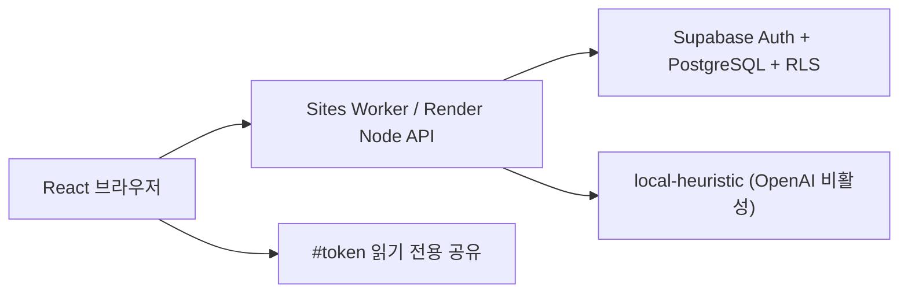

# Modu Brain — 저장·분석 이력·근거·공유가 이어지는 공개 웹 데모

> 이 문서는 챌린지 PR #209 당시의 제출 기록입니다. 현재 독립 저장소의 배포 기준은 [README](../README.md)와 [독립 배포 가이드](standalone-deployment.md)를 따릅니다.

기획서: https://gist.github.com/tjwnsdhfz/12289f2fbf66eb6e54f0edc5e0ac0dce

PR 벤치마크: https://github.com/tjwnsdhfz/modu-brain/blob/main/docs/benchmark-prs.md

## 한눈에 보기

기존 PR #209의 React/Vite·Node·로컬/OpenAI 분석 프로토타입을 실제 데이터가 유지되는 공개 데모 구조로 확장했습니다.

사용자는 이메일 Magic Link로 로그인한 뒤 프로젝트별 회의록·리서치·피드백을 저장하고, 선택한 기록으로 분석을 실행합니다. 각 분석은 불변 이력으로 남고 결과의 결정·질문·참여자 관점에서 실제 원문 근거를 확인할 수 있습니다. 최근 두 성공 결과의 변화를 비교하고, 특정 결과만 만료 가능한 읽기 전용 링크로 공유할 수 있습니다.



## 해결하려는 문제

팀의 기록이 여러 문서와 대화에 흩어지면 내용 자체보다 다음 맥락이 먼저 사라집니다.

- 왜 그렇게 결정했는가
- 누가 어떤 프로젝트 관점과 우려를 제시했는가
- 무엇이 아직 결정되지 않았는가
- 새 팀원은 무엇부터 이해해야 하는가
- 이전 분석 이후 무엇이 바뀌었는가

Modu Brain은 단순 회의 요약이 아니라 **원문 기록 → 근거가 있는 맥락 분석 → 변화 이력 → 안전한 공유**를 하나의 흐름으로 연결합니다.

## 사용자 흐름

1. `/login`에서 이메일 Magic Link로 로그인합니다.
2. `/projects`에서 개인 소유 프로젝트를 만듭니다.
3. 회의록·리서치·피드백·메모를 여러 건 저장합니다.
4. 분석할 기록과 local/OpenAI 방식을 선택합니다.
5. 분석 이력에서 요약·관점·결정·질문의 정확한 원문 근거를 엽니다.
6. 두 번째 분석 후 최근 결과와 이전 결과의 추가·변경·해결 항목을 확인합니다.
7. 브레인 캔버스에서 관점·결정·질문·핵심어를 검색하고 연결된 생각과 원문 근거를 확인한 뒤 온보딩 요약을 엽니다.
8. 1~30일 읽기 전용 링크를 만들고 필요하면 즉시 폐기합니다.
9. 새로고침 뒤에도 프로젝트·원문·분석 이력이 유지됩니다.

로그인하지 않은 사용자는 `/`에서 붙여넣기·카카오톡 TXT·Teams JSON·Notion JSON을 계정 연결이나 저장 없이 정규화·분석하거나, `/demo`에서 결정론적 샘플을 바로 체험할 수 있습니다.

## 주요 구현

### 웹 워크스페이스

- `/`, `/demo`, `/login`, `/projects`, `/projects/:id`, `/share#token=…` SPA 라우트
- 프로젝트 상세 `개요 | 기록 | 분석 이력 | 지식맵 | 온보딩` 탭
- 분석 당시 스냅숏에 연결된 근거 drawer
- 최근 성공 분석과 바로 이전 성공 분석 비교
- 결과·오류·빈 상태·진행 상태를 숨김 없이 분리
- 모바일에서도 기록, 이력, 지식맵, 공유 흐름을 유지
- 관점 차이 → 미결 질문 → 결정 배경 → 요약의 고정 정보 위계
- `DESIGN-notion.md` 기반의 warm-paper 표면, 딥 인디고 히어로, hairline 카드와 KoPubWorld 돋움 로컬 우선 타이포그래피
- 로그인 없이 계속, 자동 파일 형식 판별, 모바일 접이식 메뉴와 `Esc` 포커스 복귀
- 375/768/1024/1440px, 44px 터치 영역, focus trap·skip link, reduced motion 검증

### 인증·데이터베이스

- Supabase 이메일 Magic Link와 same-origin HttpOnly 세션 BFF
- callback token 즉시 제거, refresh rotation, `SameSite=Strict`·`Secure` 쿠키와 Web Storage 무토큰 계약
- `projects`, `source_records`, `analysis_runs`, `analysis_run_sources`, `analysis_run_step_events`, `analysis_run_annotations`, `share_links`, `rate_limit_buckets`
- SQL migration과 안전한 seed를 저장소에서 관리
- 모든 앱 테이블 RLS와 사용자 간 IDOR 차단
- 읽기는 사용자 JWT+RLS, 쓰기는 사용자 ID와 소유권을 다시 검증하는 service-only `app_*` RPC로 분리
- 일반 삭제는 보관, 확인 헤더가 있는 프로젝트 영구 삭제는 하위 데이터 cascade
- DB 장애 시 메모리 fallback 없이 구조화 `503`

### 영속 분석

- 1~50개 기록, 합계 100,000자 제한
- `Idempotency-Key`와 요청 fingerprint로 중복 비용 방지
- `running → succeeded|failed|cancelled` 실행 상태 보존
- provider 호출을 DB 트랜잭션 밖에서 실행
- 실패한 실행이 최근 성공 결과를 덮어쓰지 않음
- 모든 `EvidenceRef.quote`가 실제 실행 스냅숏에 존재하는지 서버 검증
- `source_snapshot → provider_analysis → evidence_validation → result_persistence`의 append-only 실행 추적
- 성공 결과의 실제 항목에만 idempotent·immutable annotation을 추가하는 사용자 검토 레이어
- 단계 이벤트·annotation에는 원문, prompt, provider 응답, hidden reasoning을 저장하지 않음

### OpenAI 경계

- 기본 데모는 외부 호출이 없는 `local-heuristic`
- `MODU_BRAIN_OPENAI_ENABLED=true`와 서버 API key가 함께 설정될 때만 OpenAI 선택 활성화
- 로그인 사용자가 고지에 동의하고 명시적으로 선택할 때만 OpenAI 실행
- `gpt-5.6-terra`, reasoning effort `low`; 환경변수 override 및 계정 preview 권한 확인
- Responses API 구조화 출력, `store: false`, 비식별 `safety_identifier`, 30초 제한
- 키·모델·provider 실패를 로컬 결과로 조용히 대체하지 않음

### 공유와 요청 제한

- 32바이트 무작위 token, DB에는 SHA-256만 저장
- 평문 token은 생성 직후 한 번만 반환
- query/access log를 피하는 `/share#token=…` fragment
- 기본 7일, 최대 30일, 즉시 폐기
- 공유 projection은 프로젝트 제목·정제된 결과·분석/만료 시각만 반환하고 원문·이메일·내부 ID·provider/token 정보 제외
- 사용자당 AI 동시 1건·시간 10건·일 30건, IP당 공유 조회 시간 60건
- 공개 가져오기는 same-origin, IP당 시간 20건, JSON 256KB·정규화 후 20,000자로 제한하고 DB에 저장하지 않음

## API

```text
GET|POST|DELETE  /api/v1/auth/session
POST             /api/v1/auth/refresh
GET|POST         /api/v1/projects
GET              /api/v1/capabilities
GET|PATCH|DELETE /api/v1/projects/:projectId
POST             /api/v1/projects/:projectId/restore
GET|POST         /api/v1/projects/:projectId/sources
GET|PATCH|DELETE /api/v1/sources/:sourceId
POST             /api/v1/sources/:sourceId/restore
GET|POST         /api/v1/projects/:projectId/analysis-runs
GET|DELETE       /api/v1/analysis-runs/:runId
GET              /api/v1/analysis-runs/:runId/step-events
GET|POST         /api/v1/analysis-runs/:runId/annotations
GET|POST         /api/v1/analysis-runs/:runId/share-links
DELETE           /api/v1/share-links/:shareLinkId
POST             /api/v1/shared/resolve
GET              /api/v1/account/export
DELETE           /api/v1/account
POST             /api/v1/telemetry
POST             /api/context-analysis/import
GET              /api/health/live
GET              /api/health/ready
```

기존 `POST /api/context-analysis`는 한 릴리스 동안 비영속 호환 API로 유지합니다.

## 검증

로컬 최종 확인 명령:

```bash
npm ci
npm run lint
npm run typecheck
npm run test:coverage
npm run build
supabase start
supabase db reset
supabase test db
npm run test:e2e
```

추가된 품질 범위:

- 30개 한국어 회의·리서치·피드백 fixture의 결정·질문·참여자·근거·개인정보·prompt injection 회귀
- migration 적용·down rollback·재적용과 92개 RLS/권한/FK/idempotency/rate limit/share pgTAP 계약
- Magic Link부터 프로젝트·기록 2건·분석 2회·근거·변화·공유·새로고침·폐기까지 Playwright
- GitHub Actions의 lint/typecheck/coverage/build/audit/secret scan/public smoke·axe 접근성 검사
- 내부 PR·브랜치에서 로컬 Supabase reset/pgTAP/authenticated E2E

현재 로컬 검증은 Vitest 338개 통과, statements 83.04%, branches 75.64%, functions 85.29%, lines 86.70%, 한국어 평가 31개 통과, Playwright 15개 통과·인증 전용 1개 환경 미설정 skip, `npm audit` 취약점 0건입니다. 375/768/1024/1440px, axe, 키보드, reduced-motion과 프로덕션 빌드도 통과했습니다.

실제 OpenAI 유료 호출은 CI와 두 공개 배포에서 모두 비활성화했습니다. 현재 데모는 외부 모델 비용이 없는 `local-heuristic`만 사용하며, 향후 별도 예산 승인이 있을 때만 서버 환경에서 명시적으로 활성화합니다.

## 배포 상태

- `render.yaml`: 무료 Node Web Service, fork 승인 대기와 독립된 commit 자동 배포, `/api/health/live`와 DB readiness 정상
- Sites: 버전 13에 React SPA와 Worker API를 동일 커밋으로 배포하고 기존 Supabase PostgreSQL/RLS를 공유
- Supabase 데모 프로젝트: Seoul·PostgreSQL 17, 일곱 migration 정합화, service-only mutation 경계와 전체 공개 테이블 RLS 확인
- 실제 브라우저: 공개 샘플 분석 → 근거 → 데스크톱 그래프 → 375px 의미 목록을 배포 주소에서 확인했으며 콘솔 경고·오류 0건
- Sites와 Render의 배포 origin은 Supabase Auth redirect allowlist에 각각 등록하고, 서버 전용 값은 각 호스팅 런타임에만 설정

## 리뷰 포인트

1. 읽기는 사용자 JWT+RLS를 유지하고, 쓰기는 검증된 사용자 ID를 받은 service-only RPC가 소유권을 다시 확인하는가
2. 다른 사용자 리소스가 일관된 `404`로 숨겨지는가
3. idempotency 충돌과 동시 실행 제한이 외부 모델 중복 비용을 막는가
4. 분석 근거가 실행 당시 스냅숏의 실제 문장인가
5. 공유 응답에 원문·이메일·token hash·내부 오류가 없는가
6. DB/OpenAI 실패가 최근 성공 결과나 샘플로 위장되지 않는가
7. 실행 추적과 annotation에 원문·prompt·hidden reasoning이 복제되지 않는가

## 제외 범위

팀 초대·역할 관리, 공동 편집, Slack·Notion·Teams 계정/OAuth 직접 연결, 결제, 실시간 동기화, 백그라운드 작업 큐, 임의 두 분석 간 비교는 후속 버전으로 미룹니다. 사용자가 직접 선택한 내보내기 파일과 붙여넣기는 이번 버전에서 지원합니다.

## 디자인·기획 자료

- Canva: https://www.canva.com/d/vv5pLSUhq50coma
- Figma FigJam: https://www.figma.com/board/V5Jke4dsqaoMUOiTEg57tM
- Figma 웹 프로토타입: https://www.figma.com/design/0XXQwlwMjFsVB8wreJpDkf?node-id=1-2
- 데스크톱 캡처: `docs/images/modu-brain-web-desktop.png`
- 모바일 캡처: `docs/images/modu-brain-web-mobile.png`
