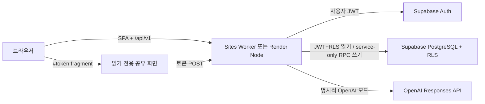

# Modu Brain 기술 요구사항 문서 (TRD)

## 1. 목적과 범위

이 문서는 Modu Brain 공개 데모의 구현 계약을 정의한다. 브라우저, 같은 출처의 Worker/Node API, Supabase Auth/PostgreSQL/RLS, 선택형 OpenAI Responses API 사이의 경계를 고정한다.

이번 범위는 개인 소유 프로젝트, 원문 기록, 불변 분석 이력, 4단계 실행 추적, 불변 결과 annotation, 최근 두 성공 결과 비교, 근거 확인, 읽기 전용 공유까지다. 팀 초대·역할, 공동 편집, 파일 파싱, 외부 협업 도구 자동 연동, 결제, 백그라운드 작업 큐는 제외한다.

## 2. 시스템 구조



| 영역 | 선택 |
| --- | --- |
| 프런트엔드 | React 19, TypeScript, Vite, 브라우저 History 라우팅 |
| 서버 | Cloudflare Worker와 Node.js HTTP, 같은 출처 정적 SPA + JSON API |
| 인증 | Supabase 이메일 Magic Link, same-origin HttpOnly access/refresh 쿠키 |
| 저장소 | Supabase PostgreSQL, SQL migration, PostgREST, RLS |
| 분석 | 결정론적 `local-heuristic`, 선택형 OpenAI Responses API 구조화 출력 |
| 검증 | Zod, 서버 입력 검증, 근거 부분 문자열 검증 |
| 품질 | ESLint, TypeScript, Vitest/V8, pgTAP, Playwright, Gitleaks |
| 배포 | Sites Worker + Render Node Web Service, Supabase Seoul 프로젝트 |

브라우저가 서비스 역할 키로 DB를 직접 수정하지 않는다. API 런타임은 HttpOnly 쿠키의 access token을 검증한 뒤 읽기를 같은 사용자 JWT의 PostgREST와 RLS로 수행한다. 쓰기는 서비스 역할만 호출할 수 있는 `app_*` RPC가 검증된 사용자 ID와 리소스 소유권을 다시 확인한 뒤 수행한다. 로그인 사용자의 테이블 직접 쓰기와 구형 RPC 실행 권한은 contract migration에서 제거한다. 브라우저 Bearer 인증과 구형 authenticated SECURITY DEFINER RPC는 받지 않는다.

## 3. 라우팅과 상태

| 경로 | 인증 | 동작 |
| --- | --- | --- |
| `/` | 공개 | 저장되지 않는 로컬 샘플과 versioned 공개 가져오기 분석 API |
| `/login` | 공개 | Magic Link 발송과 callback session 저장 |
| `/projects` | 필요 | 사용자 소유 프로젝트 목록·생성 |
| `/projects/:id` | 필요 | 개요, 기록, 분석 이력, 지식맵, 온보딩 |
| `/share#token=…` | 공개 | 원문·계정정보를 제외한 읽기 전용 결과 |

인증 session은 BFF가 access token, refresh token, 만료 시각을 HttpOnly·SameSite 쿠키에만 저장한다. 브라우저 JavaScript에는 토큰을 반환하지 않으며 sessionStorage에는 비밀값을 두지 않는다. Magic Link callback fragment는 BFF 세션 교환 직후 제거하고 주소를 `/projects`로 교체한다. 로그아웃은 서버 쿠키를 만료시키며 원격 logout 실패가 브라우저 세션 정리를 막지 않는다.

## 4. 데이터 모델

`supabase/migrations/`를 스키마의 유일한 원본으로 사용한다. Dashboard 전용 수정과 앱 시작 시 자동 migration은 금지한다.

### 4.1 주요 테이블

| 테이블 | 핵심 데이터와 불변식 |
| --- | --- |
| `projects` | UUID, `owner_id → auth.users`, 2~120자 제목, 설명, 보관·생성·수정 시각 |
| `source_records` | 프로젝트, `meeting/research/feedback/note`, 제목, 원문, SHA-256, 글자 수, 발생·보관 시각 |
| `analysis_runs` | 프로젝트, 생성자, idempotency/fingerprint, 상태, provider/model, `2.0` 결과 JSONB, 안전한 오류·지연·토큰 정보 |
| `analysis_run_sources` | 실행과 연결된 source ID, 제목·종류·내용·해시·글자 수의 불변 스냅숏 |
| `analysis_run_step_events` | 실행별 4단계의 append-only 시작·terminal 이벤트. 원문·prompt·모델 응답·사고과정 필드 없음 |
| `analysis_run_annotations` | 성공 결과 target에 사용자가 추가하는 idempotent 검토 기록. 직접 수정·삭제 불가 |
| `share_links` | 실행, 생성자, 32바이트 토큰의 SHA-256, 만료·폐기 시각 |
| `rate_limit_buckets` | scope, 비식별 subject, 시간 구간, 누적 횟수 |

프로젝트 영구 삭제는 FK cascade로 원문, 실행, 스냅숏, 공유 링크를 제거한다. 일반 프로젝트·원문 삭제는 `archived_at`을 기록한다. 분석 실행은 이력 보존을 위해 별도 삭제 API를 사용하며 성공 결과를 수정하지 않는다.

### 4.2 인덱스와 RLS

- 프로젝트: `(owner_id, updated_at desc)`
- 원문: `(project_id, created_at desc)`
- 분석: `(project_id, created_at desc)`, `(project_id, idempotency_key)` unique
- 실행 이벤트: `(analysis_run_id, sequence)`, `(analysis_run_id, event_key)` unique
- annotation: `(analysis_run_id, created_by, idempotency_key)` unique, FK용 `analysis_run_id`·`created_by` 선두 인덱스
- 공유: `token_hash` unique, `(analysis_run_id, created_at desc)`
- 모든 앱 테이블에서 RLS 활성화
- 프로젝트 소유자는 API를 통해 자신의 프로젝트와 하위 리소스만 읽고 변경하며, 브라우저 DB 역할에는 직접 mutation grant가 없음
- 공개 역할에는 테이블 직접 조회 권한 없음
- 공유 결과는 `security definer` RPC가 토큰 해시·만료·폐기만 확인해 제한된 projection 반환

다른 사용자 리소스와 RLS 거부는 API에서 동일한 `404 NOT_FOUND`로 정규화한다.

## 5. 분석 결과 계약

```ts
type EvidenceRef = {
  sourceRecordId: string;
  sourceTitle: string;
  quote: string;
};

type AnalysisRunResource = {
  id: string;
  projectId: string;
  status: "running" | "succeeded" | "failed" | "cancelled";
  schemaVersion: "2.0";
  sourceIds: string[];
  provider: { mode: "local" | "openai"; model?: string };
  result?: ContextAnalysisResultV2;
  error?: { code: string; message: string };
  createdAt: string;
  completedAt?: string | null;
};
```

실행 추적은 `source_snapshot`, `provider_analysis`, `evidence_validation`, `result_persistence` 네 단계로 제한한다. 각 단계는 `started`와 terminal 이벤트를 append-only로 기록하며 단계 이벤트가 포함할 수 있는 값은 안전한 코드, 검증 결과, 소요 시간, 원문·결과·인용 개수뿐이다. 원문, prompt, provider 응답, hidden reasoning 또는 chain-of-thought는 저장하지 않는다.

성공한 실행에는 `confirmation`, `correction`, `question`, `note` annotation을 추가할 수 있다. target은 실행 전체 또는 결과의 안정적인 decision·participant·question·term·knowledge node·participant view ID다. annotation은 생성 후 수정하지 않으며 공유 projection과 후속 모델 입력에서 제외한다. 세부 필드와 상태 전이는 [에이전트 워크플로 계약](agent-workflow-contract.md)을 따른다.

`ContextAnalysisResultV2`는 기존 요약, 참여자 관점, 결정, 질문, 핵심 용어, 지식맵, 온보딩 구조를 유지하면서 안정적인 항목 ID와 `EvidenceRef[]`를 추가한다. 서버는 다음을 검증한다.

- `sourceRecordId`가 해당 실행 스냅숏에 속함
- `sourceTitle`이 스냅숏 제목과 일치함
- `quote`가 스냅숏 원문의 실제 부분 문자열임
- 입력에 근거 없는 결정·참여자·질문은 최소 개수를 채우기 위해 생성하지 않음
- 지식맵 link의 양 끝 node가 실제 node 목록에 존재함

## 6. API 계약

성공 응답은 `{ "data": value }`, 실패 응답은 아래 형식을 사용한다.

```json
{
  "error": {
    "code": "STABLE_MACHINE_CODE",
    "message": "사용자에게 표시할 안전한 메시지",
    "details": null
  }
}
```

### 6.1 프로젝트와 원문

| Method | 경로 | 설명 |
| --- | --- | --- |
| `GET` / `POST` | `/api/v1/projects` | 목록 / 생성 |
| `GET` / `PATCH` / `DELETE` | `/api/v1/projects/:projectId` | 조회 / 수정 / 기본 보관 |
| `DELETE` | `/api/v1/projects/:projectId?permanent=true` | `X-Confirm-Permanent-Delete: delete`가 있는 영구 삭제 |
| `GET` / `POST` | `/api/v1/projects/:projectId/sources` | 원문 목록 / 생성 |
| `GET` / `PATCH` / `DELETE` | `/api/v1/sources/:sourceId` | 조회 / 수정 / 보관 |

제목은 프로젝트 2~120자, 원문 1~100,000자다. 원문 저장 시 서버가 SHA-256과 실제 글자 수를 계산한다.

### 6.2 분석 실행

```http
POST /api/v1/projects/:projectId/analysis-runs
Idempotency-Key: <8..128 characters>
Content-Type: application/json

{
  "sourceIds": ["uuid"],
  "mode": "local"
}
```

- source는 1~50개, 합계 100,000자 이하
- `(project, idempotency key, fingerprint)`가 같으면 기존 실행과 `200`
- 같은 키에 source/mode/model fingerprint가 다르면 `409 IDEMPOTENCY_CONFLICT`
- 사용자당 실행 중 1건, 시간당 10건, 일당 30건
- 새 실행 성공은 `201`; provider 실패도 실행을 `failed`로 보존
- `GET /api/v1/projects/:id/analysis-runs`, `GET|DELETE /api/v1/analysis-runs/:runId`

브라우저 인증은 same-origin HttpOnly 쿠키만 사용하며 Bearer 호환 인증은 받지 않는다. 실행 순서는 `app_start_analysis_run RPC → source_snapshot → provider_analysis → evidence_validation → result_persistence`다. 네트워크 호출 중 DB 트랜잭션을 유지하지 않는다. 클라이언트 연결 종료는 AbortSignal로 provider까지 전달되며 실행과 활성 단계는 `cancelled`가 된다.

### 6.3 단계 이벤트와 annotation

| Method | 경로 | 설명 |
| --- | --- | --- |
| `GET` | `/api/v1/analysis-runs/:runId/step-events` | 소유한 실행의 단계 이벤트를 `sequence` 순으로 조회 |
| `GET` | `/api/v1/analysis-runs/:runId/annotations` | 소유한 실행의 불변 검토 기록 조회 |
| `POST` | `/api/v1/analysis-runs/:runId/annotations` | 성공 실행의 실제 결과 target에 검토 기록 생성 |

annotation 생성은 8~128자의 `Idempotency-Key`를 요구한다. 같은 키·같은 payload는 기존 행과 `200`, 같은 키에 다른 payload는 `409 IDEMPOTENCY_CONFLICT`다. `run` target은 `targetId`가 없어야 하고 다른 target은 실제 결과에 존재하는 안정적 ID가 필요하다. 인증 사용자는 event나 annotation table을 직접 변경할 수 없다. BFF만 `app_create_analysis_run_annotation`을 `service_role`로 호출하고 사용자 ID·프로젝트 소유권·실행 상태·target을 다시 검증한다. 개별 annotation `PATCH`·`DELETE` API는 제공하지 않으며 부모 실행·프로젝트 삭제 시에만 cascade한다.

두 리소스는 공유 응답에 포함되지 않는다. API 응답도 annotation의 `created_by`, idempotency key, request fingerprint를 노출하지 않는다.

### 6.4 공유

| Method | 경로 | 설명 |
| --- | --- | --- |
| `GET` / `POST` | `/api/v1/analysis-runs/:runId/share-links` | 목록 / 성공 실행 링크 생성 |
| `DELETE` | `/api/v1/share-links/:shareLinkId` | 즉시 폐기 |
| `POST` | `/api/v1/shared/resolve` | 공개 토큰 해시 조회 |

생성 응답에서 평문 토큰은 한 번만 반환한다. UI는 `/share#token=…`을 만들며 fragment는 HTTP 요청·접근 로그에 전달되지 않는다. 공개 조회는 토큰을 JSON body로 보내고 IP당 시간당 60건으로 제한한다. 공유 응답은 `projectTitle`, 정제된 `result`, `completedAt`, `expiresAt`만 제공한다. 결과 내부의 프로젝트·실행·원문 ID, provider/model, token·latency 정보도 재귀적으로 제거한다.

### 6.5 상태 확인과 공개 분석 API

- `GET /api/health/live`: 프로세스가 요청을 처리하면 `200`; `commit`은 `options.buildCommit`, `RENDER_GIT_COMMIT`, `SOURCE_VERSION` 중 검증된 7~40자 hex 또는 `null`
- `GET /api/health/ready`: 필수 Supabase 설정과 DB 쿼리가 성공하면 `200`, 아니면 `503`
- `GET /api/v1/capabilities`: OpenAI 기능 플래그와 기본 로컬 provider를 비밀정보 없이 반환
- `POST /api/v1/public/context-analysis/import`: same-origin 공개 요청에서 카카오톡 TXT·Teams JSON·Notion JSON·일반 텍스트를 정규화하고 로컬 분석한다. DB에는 저장하지 않으며 IP당 시간당 20회, JSON 256KB, 분석 입력 20,000자 제한을 적용한다.
- `POST /api/context-analysis`, `POST /api/context-analysis/import`: 제거된 호환 경로다. `410 LEGACY_ENDPOINT_REMOVED`와 versioned 대체 경로를 반환한다.

## 7. OpenAI provider

- 기본 모델: `gpt-5.6-terra`; preview 접근 가능 여부를 배포 계정에서 확인
- `MODU_BRAIN_OPENAI_ENABLED=true`와 API key가 모두 있을 때만 인증 V1 API에서 OpenAI를 노출
- 모델과 reasoning effort는 `MODU_BRAIN_OPENAI_MODEL`, `MODU_BRAIN_OPENAI_REASONING_EFFORT`로 교체
- `reasoning.effort: low`, `store: false`, 구조화 Zod text format
- 사용자 UUID와 서버 salt의 SHA-256을 `safety_identifier`로 사용
- 서버 제한 30초; 키·인증·rate limit·timeout·스키마 실패를 안정적인 오류 코드로 변환
- OpenAI 실패를 로컬 결과로 조용히 대체하지 않음
- 브라우저는 원문 외부 전송 동의 후에만 OpenAI 모드를 실행
- 프로젝트 이름과 원문은 신뢰하지 않는 데이터로 표시하며 원문 안의 역할 변경·비밀 공개·출력 형식 변경 지시를 따르지 않음
- hidden reasoning·chain-of-thought를 요청하거나 결과·단계 이벤트·로그에 저장하지 않음

공식 모델 목록과 계정 권한이 다를 수 있으므로 배포 전에 [OpenAI 모델 문서](https://developers.openai.com/api/docs/models)를 확인한다.

## 8. 보안·개인정보

- 모든 mutation에서 `Origin`이 실제 proxy host/protocol과 같은지 검증
- JSON body 256KB, 분석 원문 합계 100,000자 제한
- CSP, `frame-ancestors 'none'`, `X-Frame-Options: DENY`, `nosniff`, 엄격한 referrer·permissions 헤더
- API 키, service role, JWT, 원문, 공유 평문 토큰을 로그에 기록하지 않음
- 원문은 `source_records`와 명시적 분석 스냅숏에만 보관하며 단계 이벤트·annotation에 중복 저장하지 않음
- annotation은 사용자 검토 데이터로만 취급하고 후속 모델 입력이나 공개 공유 결과에 자동 포함하지 않음
- service role은 `VITE_` 변수나 브라우저 응답에 포함하지 않음
- provider 오류 원문과 PostgREST 내부 상세를 사용자 응답에 포함하지 않음
- 공유 링크 기본 7일·최대 30일·즉시 폐기
- 원문과 스냅숏은 사용자 동의 아래 저장하고 프로젝트 영구 삭제 시 함께 제거
- DB 장애 시 메모리 저장으로 전환하지 않고 `503 DATABASE_UNAVAILABLE`

## 9. 환경과 배포

필수 서버 변수는 `SUPABASE_URL`, `SUPABASE_PUBLISHABLE_KEY`, `SUPABASE_SECRET_KEY`다. 브라우저 Magic Link 빌드에는 같은 프로젝트의 `VITE_SUPABASE_URL`, `VITE_SUPABASE_PUBLISHABLE_KEY`가 필요하다. 로컬 Supabase CLI에서는 기존 anon/service-role JWT 변수도 fallback으로 지원한다. OpenAI는 기능 플래그 기본값이 꺼져 있으므로 키가 없어도 로컬 모드는 동작한다.

`render.yaml` 계약:

- 독립 저장소의 `main` branch, Singapore, Node Web Service
- build `npm ci --include=dev && npm run build`
- start `npm start`
- `HOST=0.0.0.0`, Render 제공 `PORT`
- 플랫폼 health check `/api/health/live`, 배포 후 DB readiness 확인 `/api/health/ready`
- CI checks 통과 후 auto deploy
- secret 값은 `sync: false`이며 Render Dashboard에만 입력

Sites 계약:

- `.openai/hosting.json`의 프로젝트 ID를 재사용하고 D1/R2는 사용하지 않음
- `dist/server/index.js` Worker와 `dist/client` SPA를 같은 버전으로 배포
- Supabase/OpenAI 비밀은 Sites 런타임 환경에만 설정
- Node 요청·응답 어댑터로 기존 API 계약과 Render fallback을 공유

배포 순서는 `Supabase migration → Sites/Render secret 설정 → build·테스트 → 소스 push → Sites/Render deploy → Auth /login redirect allowlist → readiness → 브라우저 E2E`다. Seoul Supabase 데모 프로젝트에는 core·외부 맥락 migration과 에이전트 워크플로 migration이 적용되어 있다. 워크플로 migration은 원격 스키마의 단일 트랜잭션 안에서 적용·92개 pgTAP·down rollback·재적용을 먼저 검증한 뒤 영구 적용했고, 적용 직후 security·performance advisor를 확인했다.

## 10. 테스트와 승인 기준

| 계층 | 필수 시나리오 |
| --- | --- |
| Vitest | 입력 경계, CRUD routing, auth 실패, IDOR `404`, idempotency, provider 성공·실패·취소, 잘못된 근거, DB `503`, 공유 만료·폐기 |
| SQL + pgTAP | 빈 DB migration 적용·down rollback·재적용, 92개 FK·RLS·권한·annotation idempotency·rate limit·공개 share 계약 |
| 한국어 eval | 30개 회의·리서치·피드백·질문-only·결정-only·빈 근거·개인정보·prompt injection fixture; 외부 호출 없음 |
| Playwright | 공개 샘플, Magic Link, 프로젝트·기록 2건, 분석 2회, 근거 drawer, 최근 변화, 지식맵, 공유·새로고침·폐기 |
| CI | lint, typecheck, coverage, build, production audit, secret scan, 공개 smoke, 내부 PR Supabase/E2E |

커버리지 하한은 statements 80%, functions 75%, branches 75%를 목표로 유지한다. 유료 OpenAI live call은 CI에서 금지하고 별도 승인된 한국어 품질 평가에서만 수행한다.
